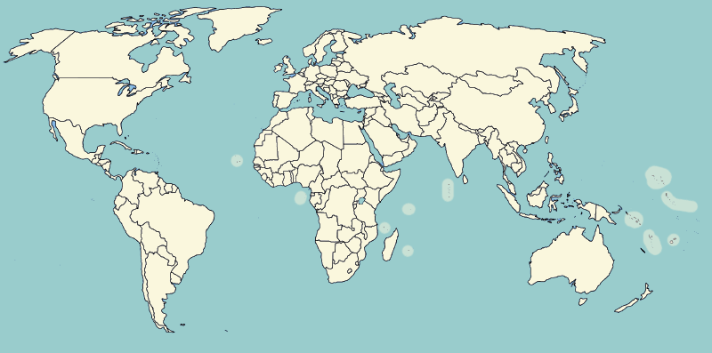

# world-countries-capital

[](https://travis-ci.org/mbao01/world-countries-capital)
[](https://codecov.io/github/mbao01/world-countries-capital)
[](http://npm.im/world-countries-capital)
[](http://npm-stat.com/charts.html?package=world-countries-capital&from=2015-08-01)
[](http://opensource.org/licenses/MIT)
[](https://github.com/semantic-release/semantic-release)

World countries (and capital) library. Find very basic geographical, cultural, etc. information about all countries of the world.



## Installation

This package is distributed via npm:

```
npm install world-countries-capital
```

## Usage

```javascript
var names = require('world-countries-capital');
var allNames = names.all;
var randomName = names.random();
var threeRandomNames = names.random(3);
```

### Project Setup

This project assumes you have [NodeJS v6](http://nodejs.org/) or greater installed. You should
also have [npm v3](https://www.npmjs.com/) or greater installed as well (this comes packaged
with Node 6). You'll also need a recent version of [git](https://git-scm.com/) installed
as well.

#### Validate branch:

```
npm run validate
```

#### Build and run in *production* mode:

```
npm run build
```

#### Commit changes in staging area:

```
git add .
npm run commit
```

## Other

This library was developed by [me](https://twitter.com/mbao_01) as part of an
[egghead.io](http://egghead.io/) series called "How to Write a JavaScript Library."


If you get any failures at this point something is wrong and needs to be fixed. Remember,
[Google](https://google.com) and [StackOverflow](https://stackoverflow.com) are your friends.

You might find it helpful to see a list of the available branches. Run: `git branch` for that.